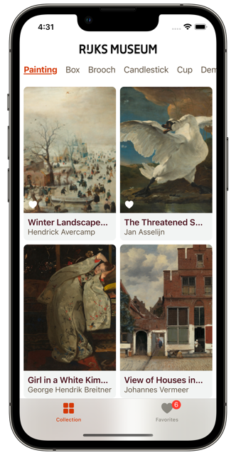
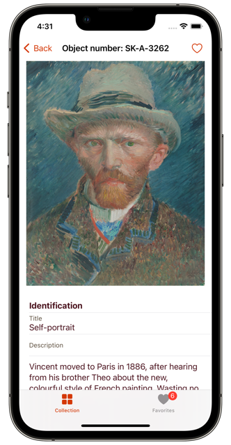
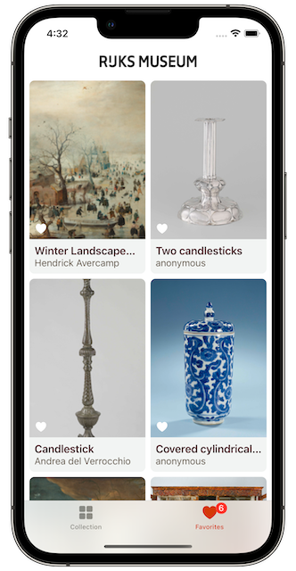

# RijksmuseumApp

As an art and history lover, I decided to make this iOS app about the Rijksmuseum in Amsterdam, the Dutch National Museum. The idea of the app is to show the collection of the Rijksmuseum provided by their open [API](https://data.rijksmuseum.nl/object-metadata/api/).

&nbsp;&nbsp;
&nbsp;&nbsp;

# Features

- Browse the art collection navigating by the type of object
- Support infinite scroll pagination
- Tap an art object to see details such as artist, size, material, measurement, and more
- Mark an object as a favorite
- Browse through all previously favorited objects
- Support for light and dark mode
- Support for iPad

# Built With

- The app was entirely built using Swift language
- UI was build using SwiftUI
- Used MVVM as a design pattern
- Used async/await for asynchronous code
- Favorites data is persisted using CoreData
- Used Combine to react to changes
- Navigation was built using `NavigationStack`
- Used [Kingfisher](https://github.com/onevcat/Kingfisher) package for downloading and caching images
